# Gandiva: Extended Security Posture Management (xSPM)

<p align="center">
  
</p>

> ⚠️ **Note:** This project was originally forked from [`shashvik/gandiva-xspm`](https://github.com/shashvik/gandiva-xspm), but that repository has since been deleted. This repository is now maintained independently. Major parts of the original codebase were authored by [shashvik](https://github.com/shashvik). Credit goes to him for the core architecture and initial implementation.

Gandiva is an advanced Extended Security Posture Management (xSPM) platform designed to help organizations monitor, assess, and improve their cloud security posture across multi-cloud environments. It offers deep visibility into cloud assets, detects security issues, and provides actionable remediation guidance.

## 📚 Table of Contents

- [How to Deploy](#how-to-deploy)
  - [Prerequisites](#prerequisites)
  - [Docker Deployment](#docker-deployment)
  - [Docker Compose Deployment](#docker-compose-deployment)
  - [Accessing Gandiva](#accessing-gandiva)
- [Key Features](#key-features)
- [Architecture](#architecture)
  - [Technology Stack](#technology-stack)
- [Project Structure](#project-structure)
- [Cloud Resource Scanning](#cloud-resource-scanning)
  - [AWS Configuration](#aws-configuration)
  - [Kubernetes Configuration](#kubernetes-configuration)
- [Security Considerations](#security-considerations)
- [Documentation](#documentation)
- [Screenshots](#screenshots)
- [Contributors](#contributors)

## 🚀 How to Deploy

### Prerequisites
Ensure you have:
- Docker installed.
- AWS credentials configured (`~/.aws`).
- Kubernetes configuration (`~/.kube`).

### Docker Deployment

To run Gandiva using Docker:
1. **Clone the repository:**
    ```bash
    git clone https://github.com/h4r5h1t/gandiva-xspm.git
    cd gandiva-xspm
    ```

2. **Build Docker images:**  
   > Note: Image builds may take several minutes. Please be patient.
   ```bash
   docker build -t gandiva-backend -f Dockerfile.backend . 
   docker build -t gandiva-frontend -f Dockerfile.frontend .
   ```

3. **Start the containers:**
   ```bash
   chmod +x start_gandiva.sh
   ./start_gandiva.sh
   ```

### Docker Compose Deployment

For a simpler deployment:

1. **Clone the repository:**
   ```bash
   git clone https://github.com/h4r5h1t/gandiva-xspm.git
   cd gandiva-xspm
   ```

2. **Launch using Docker Compose:**
    > Note: Image builds may take several minutes. Please be patient.
    ```bash
    docker compose up -d --build
    ```

3. **Verify that containers are running:**
   ```bash
   docker compose ps
   ```

### Accessing Gandiva

- **Frontend:** [http://localhost:8080](http://localhost:8080)
- **Default Credentials:**
  - **Username:** `gandiva`
  - **Password:** `gandiva_password`

## ✨ Key Features

- 🔍 **Multi-Cloud Asset Inventory** – Unified view of AWS, Kubernetes, and other resources.
- 🚨 **Security Findings** – Detect misconfigurations and compliance issues.
- 🕸️ **Relationship Visualization** – Graph-based visualization of resource interconnections.
- 🛡️ **Vulnerability Management** – Identify and remediate resource vulnerabilities.
- ✅ **Benchmark Compliance** – CIS, NIST compliance assessments.
- 🐳 **Container Security** – Detect vulnerabilities in container images and configurations.
- 🧪 **Database Security** – Analyze and monitor database posture.
- 🔐 **Secret Detection** – Find exposed secrets in source code.
- 📊 **Interactive Dashboard** – Clean, intuitive interface for actionable insights.

## 🏗️ Architecture

Gandiva comprises the following core components:

1. **Backend API:** Flask-based RESTful API server integrating various scanning tools.
2. **Frontend UI:** React-based dashboard with rich visualization and controls.
3. **Analysis Engine:** Integration with Steampipe and Neo4j for data analysis and visualization.

### 🛠️ Technology Stack

- **Frontend:** React, TypeScript, Tailwind CSS, Shadcn UI, React Flow.
- **Backend:** Python, Flask, Flask-RESTful, JWT Authentication.
- **Databases:** MongoDB for application data, Neo4j for graph visualization.
- **Scanning:** Steampipe for cloud resource scanning, Checkov, Trivy, custom scanners.
- **Deployment:** Docker Compose, Kubernetes-ready.

## 🗂️ Project Structure

```
gandiva/
├── backend/              # Flask backend application
│   ├── app.py            # Main application entry point
│   ├── resources.py      # API resources and endpoints
│   ├── neo4j_*.py        # Neo4j integration
│   ├── steampipe_*.py    # Steampipe integration
│   └── *_scanner_*.py    # Various scanners
├── frontend/             # React frontend application
│   ├── src/              # Source code
│   │   ├── components/   # React components
│   │   ├── pages/        # Page components
│   │   └── services/     # API services
│   └── public/           # Static assets
├── docker-compose.yml    # Docker Compose configuration
└── Dockerfile.*          # Docker build configurations
```

## 🔍 Cloud Resource Scanning

Gandiva leverages **Steampipe** to scan multi-cloud resources.

### AWS Configuration

Ensure AWS CLI is set up with valid credentials:

```bash
aws configure
```

### Kubernetes Configuration

Ensure your `~/.kube/config` file is properly configured and has access to your cluster.

## 🔐 Security Considerations

- All endpoints are protected using JWT token authentication.
- Role-based access control for administrative functions.
- Secure storage of cloud credentials.
- Token refresh mechanism for persistent sessions.

## 📖 Documentation

- [Backend Documentation](./backend/README.md)
- [Frontend Documentation](./frontend/README.md)
- [Authentication Guide](./frontend/README-AUTH.md)

## 📸 Screenshots

### Login Page
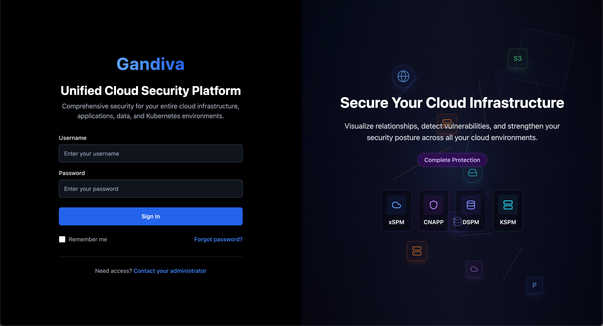

### Dashboard Overview
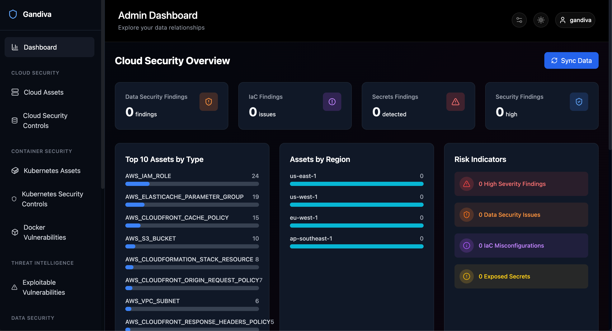

### Commpliance Dashboard
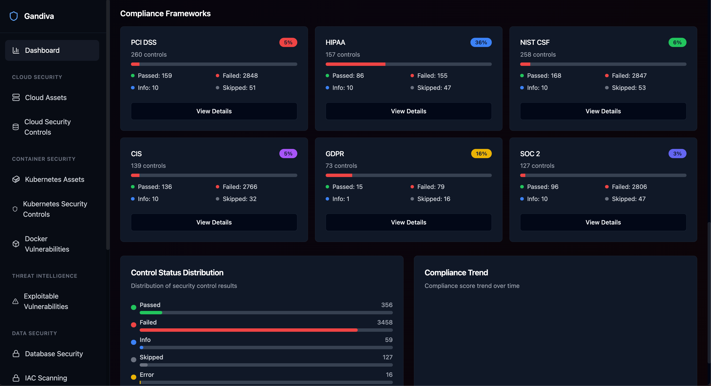

### Commpliance Details
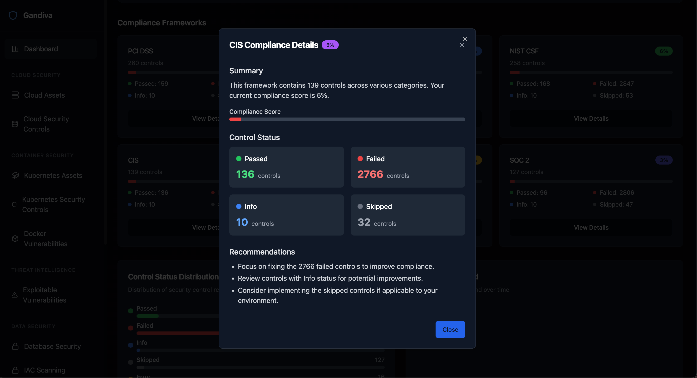

### Graph Visualization
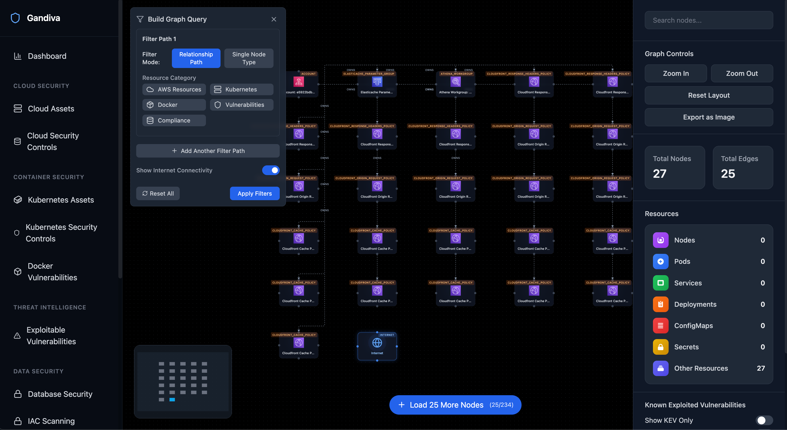

### Asset Inventory
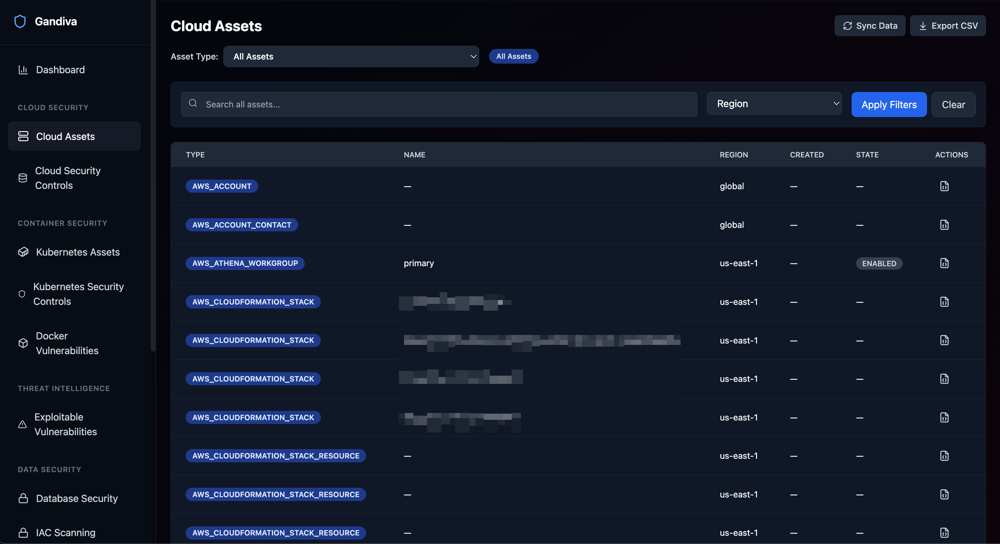

### Asset Details
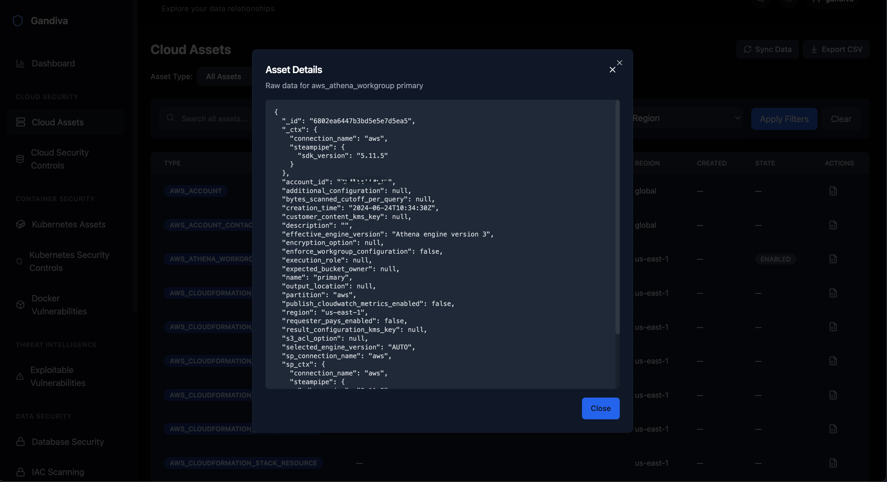

### Security Controls
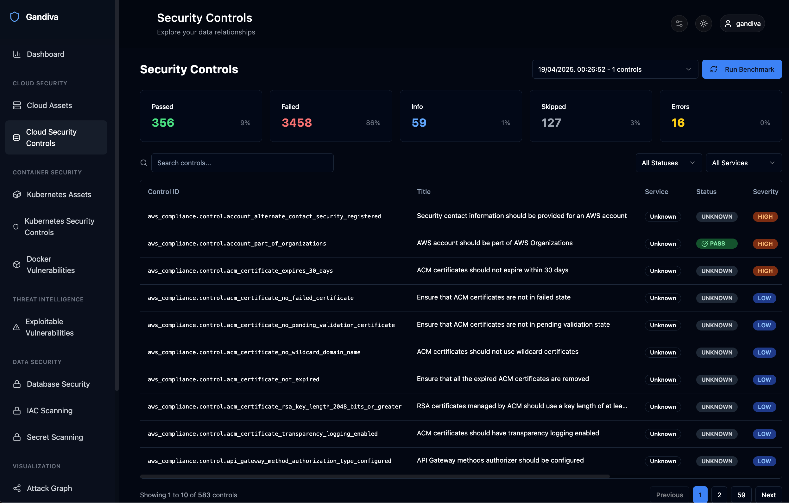

### Security Controls Details
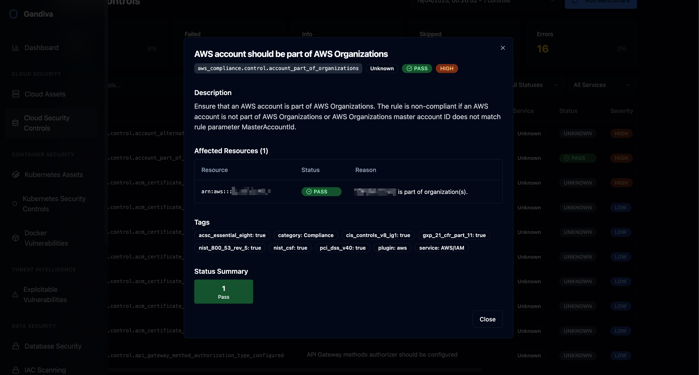

### Data Security
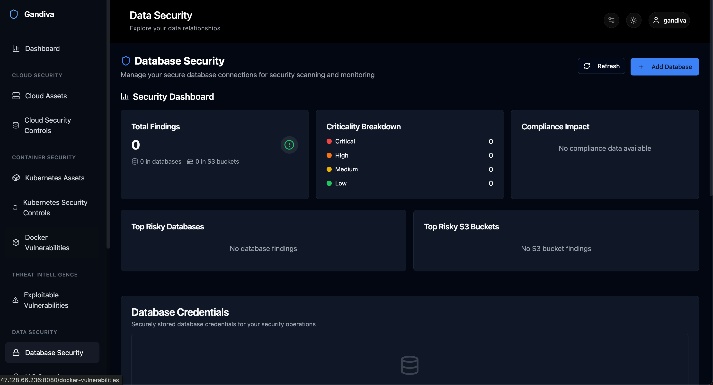

### Data Security - S3 Bucket
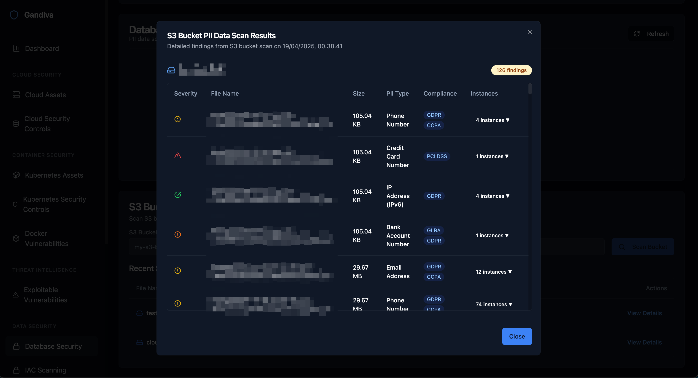

## 👥 Contributors

<a href="https://github.com/shashvik">
  
  <br />
  <sub><b>shashvik</b></sub>
</a>

<a href="https://github.com/h4r5h1t">
  
  <br />
  <sub><b>h4r5h1t</b></sub>
</a>

> Special thanks to **@shashvik** for the original groundwork. This project is now independently maintained and developed by **@h4r5h1t**.
